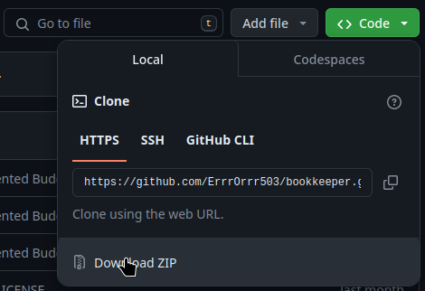
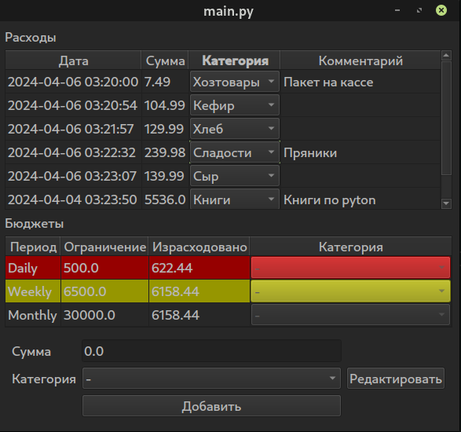
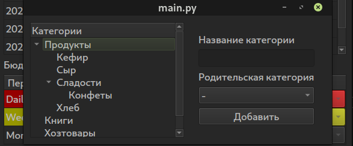

# Программа для управления личными финансами
#### (учебный проект для курса по практике программирования на Python)

Проект реализует [Техническое задание](specification.md)

## Оглавление
-[Установка](#установка)

-[Использование](#использование)

-[Разработка и тестирование](#разработка-и-тестирование)

## Установка
Проект использует [poetry](https://python-poetry.org/) для управления зависимостями.
1. Установка poetry.
    * Poetry рекомендует использовать pipx или скрипт установщик.
    [Официальная инструкция по установке poetry](https://python-poetry.org/docs/)

    * Для Linux можно попробовать использовать версию из репозитория, но нужна как минимум >= 1.3.
        * debian-based (debian, ubuntu, etc.):
        ```console
        $ sudo apt install python3-poetry
        ```
        * arch-based (arch, manjaro, garuda, etc.):
        ```console
        $ sudo pacman -S python-poetry
        ```
    * Windows
    TODO

2. Клонирование проекта.
```console
$ git clone https://github.com/ErrrOrrr503/bookkeeper
$ cd bookkeeper
```
(Может потребоваться [установить git](https://git-scm.com/book/en/v2/Getting-Started-Installing-Git).)

Также можно просто скачать содержимое репозитория в виде архива:


3. Установка среды poetry.
```console
$ poetry install --only main
```
`--only main` устанавливает только зависимости для запуска, но не для разработки и тестирования.

4. Запуск приложения.
```
$ poetry run python bookkeeper/main.py
```

## Использование

Главное окно приложения выглядит так:


#### Расходы
В верхней части окна располагается редактируемая таблица расходов.

Редактирование текста начинается по двойному щелчку мыши, ниспадающих списков по одинарному щелчку. Все поля таблицы можно редактировать. По окончании редактирования данные в репозитории сразу обновляются (это справедливо для всех операций редактирования).

В таблице работает контекстное меню с опциями удаления и добавления. Удаляется запись, соответствующая выбранной (активной) ячейке. Также удалять записи можно при помощи клавиши Delete. При добавлении через контекстное меню - добавляется запись с текущей датой, суммой 0, без категории и комментария.

При вводе некорректных данных появится сообщение об ошибке и будет восстановлено предыдущее значение.

#### Бюджеты
В середине находится таблица с бюджетами на день, неделю, месяц.

Ограничение бюджетов редактируется по двойному щелчку. Остальные поля не редактируются.

При превышении бюджета, он окрашивается в красный. При приближении к ограничению (Израсходовано > <часть> Ограничения) - желтым. <часть> настраивается в файле конфигурации, по умолчанию - 0.9.

Бюджеты пересчитываются при операциях с расходами, бюджетами и категориями. Пересчитываются отчетные периоды и, соответственно, израсходованные суммы. Описание периодов:
* На день - на текущий день, т.е. с начала до конца текущих суток.
* На неделю - на текущую неделю по iso календарю.
* На месяц - на текущий календарный месяц.

#### Добавление записи о расходе.
В нижней части окна располагается виджет добавления расходов.

В нем указывается сумма и категория расхода. При нажатии кнопки *Добавить* - добавляется запись с текущей датой, указанными суммой и категорией и пустым комментарием. Дату и комментарий можно отредактировать в таблице расходов.

Кнопка *Редактировать* открывает окно редактирования категорий.

#### Редактирование категорий


Категории представлены в виде дерева.

Кликнув по категории из дерева два раза - можно отредактировать ее название. Название категории должно быть не пустым, уникальным и не совпадать с обозначением отсутствия категории '-'.

Категории из дерева можно удалять из контекстного меню и при помощи клавиши *Delete*. При удалении категории все ее подкатегории также удаляются. Записям, относящимся к удаленным категориям, назначается категория-родитель удаленной. Так, если были категории Родитель -> Ребенок -> Внук, при удалении категории Ребенок, будут удалены Ребенок и Внук. Записям с категориями Ребенок и Внук будет назначена категория Родитель.

Справа располагается виджет добавления категорий. В нем указывается название новой категории и выбирается ее родитель.

#### Конфигурация
На текущий момент конфигурация задается в файле `bookkeeper/config/config.ini`.

## Разработка и тестирование
Для разработки и тестирования необходимо установить все зависимости:
```console
$ poetry install
```
#### Тесты и проверки
Проект типизирован при помощи *mypy*, тесты реализованы на *pytest*.

* Тесты со сбором покрытия:
    ```console
    $ poetry run pytest --cov
    ```
* Проверка типов *mypy*:
    ```console
    $ poetry run mypy --strict bookkeeper
    ```
* Линтер *pylint*:
    ```console
    $ poetry run pylint bookkeeper
    ```
* Проверка соответствия PEP8 *flake8*:
    ```console
    $ poetry run flake8 bookkeeper
    ```

В проекте есть скрипт автоматизации запуска проверок - *run_checks.py*, который запускает все проверки выше:
```console
$ poetry run python run_checks.py
```

Текущее состояние проверок:

* Тесты: Покрытие: 96% Min, 99% Avg. [HTML отчет](https://htmlpreview.github.io/?https://github.com/ErrrOrrr503/bookkeeper/test_coverage.html/index.html).
* Mypy: OK
* Pylint: 9.68
* flake8: Ok

#### Структура проекта.
Используется архитектура Model-View-Presenter c репозиторием.

📁 bookkeeper — исполняемый код

- 📁 config — конфигурация проекта.

    - 📄 config.ini - основной файл конфигурации
    - 📄 configurator.py - средство работы с файлами конфигураций.
    - 📄 constants.py - константы, используемые в проекте и не предназначенные для изменения пользователем.

- 📁 locale — локализация (перевод) приложения
    - 📁 ru/LC_MESSAGES
        - 📄 bookkeeper.mo - скомпилированный перевод
        - 📄 bookkeeper.po - файл перевода
    - 📄 bookkeeper.pot - шаблон перевода
    - 📄 gettext.py - инициализация средства перевода gettext

- 📁 models — модели данных

    - 📄 budget.py - бюджет
    - 📄 category.py - категория расходов
    - 📄 expense.py - расходная операция
- 📁 repository - репозиторий для хранения данных

    - 📄 abstract_repository.py - описание интерфейса
    - 📄 memory_repository.py - репозиторий для хранения в оперативной памяти
    - 📄 sqlite_repository.py - репозиторий для хранения в sqlite
    - 📄 repository_factory.py - фабрика репозиториев
    - 📄 sqlite_repository.db - тестовая БД для sqlite репозитория
- 📁 view — графический интерфейс
    - 📄 abstract_view.py - описание интерфейса
    - 📄 qt6_view.py - реализация на pyside6
- 📄 main.py - связующая логика, presenter
- 📄 simple_client.py — простая консольная утилита, позволяющая посмотреть на работу программы в действии (устарела)
- 📄 utils.py — вспомогательные функции

📁 tests — тесты (структура каталога дублирует структуру bookkeeper)

#### Работа с переводом
Перевод выполнен при помощи gettext. Для генерации шаблона и перевода используется pybabel.

Сгенерировать новый шаблон:
```console
$ poetry run pybabel extract bookkeeper/ -o bookkeeper/locale/bookkeeper.pot
```

Проинициализировать новый файл перевода (для ru локализации):
```console
poetry run pybabel init -l ru -i bookkeeper/locale/bookkeeper.pot -d bookkeeper/locale/ -D bookkeeper
```

Или обновить существующий:
```console
$ poetry run pybabel update -l ru -i bookkeeper/locale/bookkeeper.pot -d bookkeeper/locale/ -D bookkeeper
```

После этого можно выполнить (до)перевод в `bookkeeper/locale/ru/LC_MESSAGES/bookkeeper.pot`

Наконец, скомпилировать перевод:
```console
poetry run pybabel compile -d bookkeeper/locale/ -D bookkeeper
```